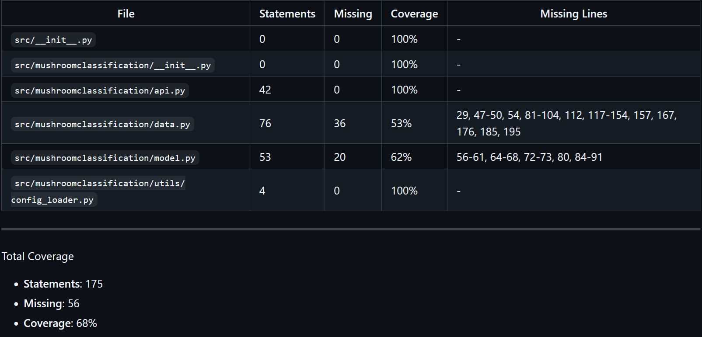
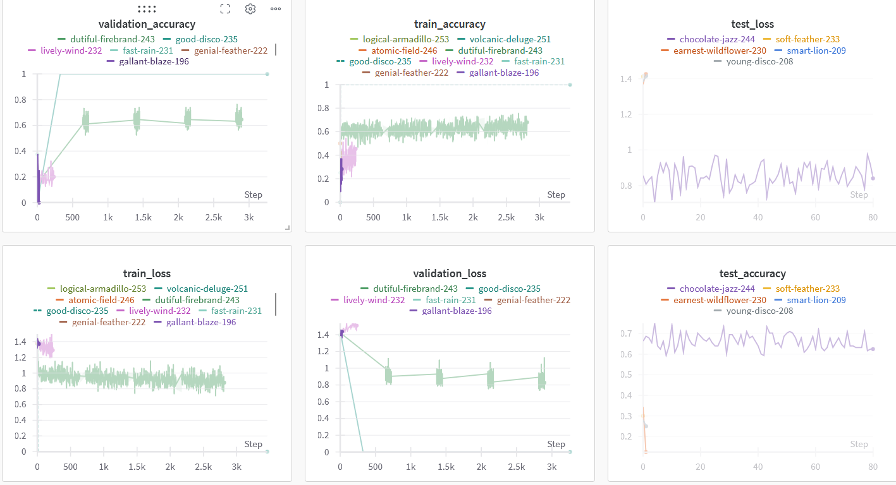
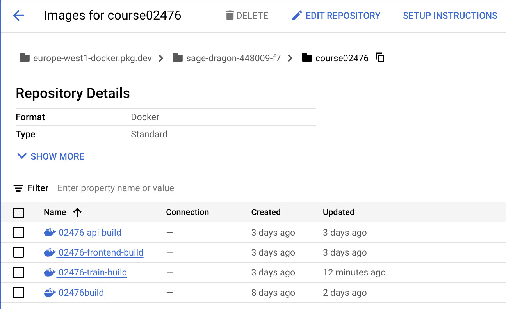
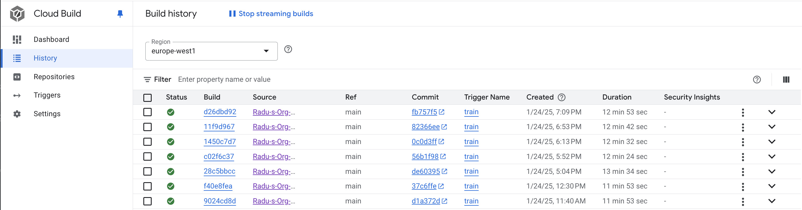
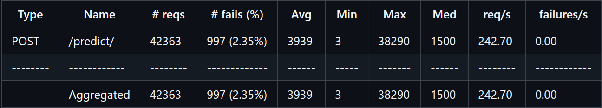
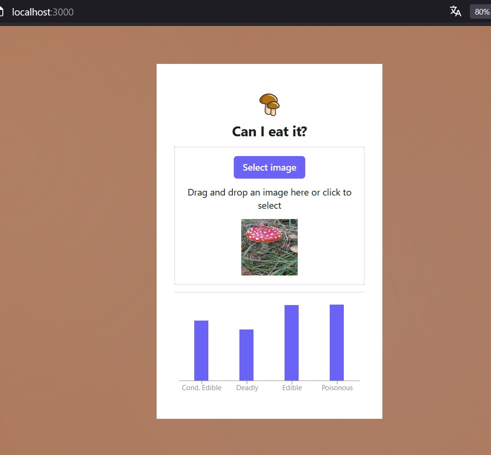

# Exam template for 02476 Machine Learning Operations

This is the report template for the exam. Please only remove the text formatted as with three dashes in front and behind
like:

`--- question 1 fill here ---`

Where you instead should add your answers. Any other changes may have unwanted consequences when your report is
auto-generated at the end of the course. For questions where you are asked to include images, start by adding the image
to the `figures` subfolder (please only use `.png`, `.jpg` or `.jpeg`) and then add the following code in your answer:

```markdown

```

In addition to this markdown file, we also provide the `report.py` script that provides two utility functions:

Running:

```bash
python report.py html
```

Will generate a `.html` page of your report. After the deadline for answering this template, we will auto-scrape
everything in this `reports` folder and then use this utility to generate a `.html` page that will be your serve
as your final hand-in.

Running

```bash
python report.py check
```

Will check your answers in this template against the constraints listed for each question e.g. is your answer too
short, too long, or have you included an image when asked. For both functions to work you mustn't rename anything.
The script has two dependencies that can be installed with

```bash
pip install typer markdown
```

## Overall project checklist

The checklist is _exhaustive_ which means that it includes everything that you could do on the project included in the
curriculum in this course. Therefore, we do not expect at all that you have checked all boxes at the end of the project.
The parenthesis at the end indicates what module the bullet point is related to. Please be honest in your answers, we
will check the repositories and the code to verify your answers.

### Week 1

- [x] Create a git repository (M5)
- [x] Make sure that all team members have write access to the GitHub repository (M5)
- [x] Create a dedicated environment for you project to keep track of your packages (M2)
- [x] Create the initial file structure using cookiecutter with an appropriate template (M6)
- [ ] Fill out the `data.py` file such that it downloads whatever data you need and preprocesses it (if necessary) (M6)
- [x] Add a model to `model.py` and a training procedure to `train.py` and get that running (M6)
- [x] Remember to fill out the `requirements.txt` and `requirements_dev.txt` file with whatever dependencies that you
      are using (M2+M6)
- [x] Remember to comply with good coding practices (`pep8`) while doing the project (M7)
- [x] Do a bit of code typing and remember to document essential parts of your code (M7)
- [x] Setup version control for your data or part of your data (M8)
- [x] Add command line interfaces and project commands to your code where it makes sense (M9)
- [x] Construct one or multiple docker files for your code (M10)
- [x] Build the docker files locally and make sure they work as intended (M10)
- [x] Write one or multiple configurations files for your experiments (M11)
- [x] Used Hydra to load the configurations and manage your hyperparameters (M11)
- [ ] Use profiling to optimize your code (M12)
- [x] Use logging to log important events in your code (M14)
- [x] Use Weights & Biases to log training progress and other important metrics/artifacts in your code (M14)
- [ ] Consider running a hyperparameter optimization sweep (M14)
- [x] Use PyTorch-lightning (if applicable) to reduce the amount of boilerplate in your code (M15)

### Week 2

- [x] Write unit tests related to the data part of your code (M16)
- [x] Write unit tests related to model construction and or model training (M16)
- [x] Calculate the code coverage (M16)
- [x] Get some continuous integration running on the GitHub repository (M17)
- [x] Add caching and multi-os/python/pytorch testing to your continuous integration (M17)
- [x] Add a linting step to your continuous integration (M17)
- [x] Add pre-commit hooks to your version control setup (M18)
- [ ] Add a continues workflow that triggers when data changes (M19)
- [ ] Add a continues workflow that triggers when changes to the model registry is made (M19)
- [x] Create a data storage in GCP Bucket for your data and link this with your data version control setup (M21)
- [x] Create a trigger workflow for automatically building your docker images (M21)
- [x] Get your model training in GCP using either the Engine or Vertex AI (M21)
- [x] Create a FastAPI application that can do inference using your model (M22)
- [x] Deploy your model in GCP using either Functions or Run as the backend (M23)
- [x] Write API tests for your application and setup continues integration for these (M24)
- [x] Load test your application (M24)
- [ ] Create a more specialized ML-deployment API using either ONNX or BentoML, or both (M25)
- [x] Create a frontend for your API (M26)

### Week 3

- ❌ Check how robust your model is towards data drifting (M27)
- ❌ Deploy to the cloud a drift detection API (M27)
- [ ] Instrument your API with a couple of system metrics (M28)
- [x] Setup cloud monitoring of your instrumented application (M28)
- [x] Create one or more alert systems in GCP to alert you if your app is not behaving correctly (M28)
- [ ] If applicable, optimize the performance of your data loading using distributed data loading (M29)
- [ ] If applicable, optimize the performance of your training pipeline by using distributed training (M30)
- [ ] Play around with quantization, compilation and pruning for you trained models to increase inference speed (M31)

### Extra

- [ ] Write some documentation for your application (M32)
- [ ] Publish the documentation to GitHub Pages (M32)
- [ ] Revisit your initial project description. Did the project turn out as you wanted?
- [ ] Create an architectural diagram over your MLOps pipeline
- [ ] Make sure all group members have an understanding about all parts of the project
- [x] Uploaded all your code to GitHub

❌ = Not Needed for Project Submission (for many reasons)

- [x] = Done

## Group information

### Question 1

> **Enter the group number you signed up on <learn.inside.dtu.dk>**
>
> Answer:

MLOPS4 i.e., group number 4

### Question 2

> **Enter the study number for each member in the group**
>
> Example:
>
> _sXXXXXX, sXXXXXX, sXXXXXX_
>
> Answer:

s242580, s242591, s113117, s246415

### Question 3

> **A requirement to the project is that you include a third-party package not covered in the course. What framework** > **did you choose to work with and did it help you complete the project?**
>
> Recommended answer length: 100-200 words.
>
> Example:
> _We used the third-party framework ... in our project. We used functionality ... and functionality ... from the_ > _package to do ... and ... in our project_.
>
> Answer:

Albumentations - it’s a library used for image augmentation. It provides a variety of transformations, such as flipping, rotating, cropping, adding noise, and adjusting brightness, making datasets more diverse and models more robust. It has many other transformations that we didn't need to use.

In our project, we used Albumentations to enhance our dataset by generating augmented versions of our images. Generally, this can improve our model by reducing overfitting and giving more image variation.

In particular, the 'deadly' class has a very low number of images compared to the other classes and should benefit a lot from augmentation.

In reality, the classifying goal proved to be quite difficult because there are mushroom species that differ very little in appearance from their edible counterpart.

## Coding environment

> In the following section we are interested in learning more about you local development environment. This includes
> how you managed dependencies, the structure of your code and how you managed code quality.

### Question 4

> **Explain how you managed dependencies in your project? Explain the process a new team member would have to go** > **through to get an exact copy of your environment.**
>
> Recommended answer length: 100-200 words
>
> Example:
> _We used ... for managing our dependencies. The list of dependencies was auto-generated using ... . To get a_ > _complete copy of our development environment, one would have to run the following commands_
>
> Answer:

We managed pip dependencies in our project using requirements.txt for runtime dependencies and requirements_dev.txt for development dependencies. We specified the exact version to install.

These files were manually updated to include all necessary libraries, such as PyTorch, Albumentations, and FastAPI. During development, installation can be done through 'pip install -r requirements_dev.txt'.

If someone would want to create the exact setup, they first need to have python installed. Then, they would need to run the following commands.

      python -m venv myenv

      source myenv/bin/activate

      pip install -r requirements.txt

      pip install -r requirements-dev.txt

Afterwards, they can refer to the tasks.py to use the appropriate 'invoke' commands.

### Question 5

> **We expect that you initialized your project using the cookiecutter template. Explain the overall structure of your** > **code. What did you fill out? Did you deviate from the template in some way?**
>
> Recommended answer length: 100-200 words
>
> Example:
> _From the cookiecutter template we have filled out the ... , ... and ... folder. We have removed the ... folder_ > _because we did not use any ... in our project. We have added an ... folder that contains ... for running our_ > _experiments._
>
> Answer:

---

We utilized the SkafteNicki cookiecutter template with the command cookiecutter https://github.com/SkafteNicki/mlops_template and its overall structure (as we mostly filled out the files in src and tests) differs a bit. The tests folder has three subfolders, one for each type of test.

Our structure differs from the template in the following ways:

The raw data is stored in data/raw (using DVC to pull). We created a subset of the raw data with 100 random images from each class using the following command:

invoke create-subset --source-dir="data/raw/Classes" --target-dir="data/raw_subset" --classes="conditionally_edible,deadly,edible,poisonous" --num-samples=100

The subset is stored in data/raw_subset and is mainly used for testing.

We created a folder named 'config' with files relevant for configuring the model. Additionally, in the root directory, we have two Cloud Build configuration files and vertex-config.yaml for configuring the Vertex AI jobs.

---

### Question 6

> **Did you implement any rules for code quality and format? What about typing and documentation? Additionally,** > **explain with your own words why these concepts matters in larger projects.**
>
> Recommended answer length: 100-200 words.
>
> Example:
> _We used ... for linting and ... for formatting. We also used ... for typing and ... for documentation. These_ > _concepts are important in larger projects because ... . For example, typing ..._
>
> Answer:

We used Ruff for linting with a maximum line length of 120 and the error codes E, F, I, and C, meaning it checks for syntax errors, formatting issues, import order, and cyclomatic complexity.

We configured it in pyproject.toml, applied Ruff testing to our GitHub Actions (testing on each commit), and added a step that fixes Ruff errors during pre-commit. So, as long as all team members have pre-commit installed, everything should be formatted according to the rules, and if not, the Ruff check will fail for the pull request.

Overall, it helps to keep the codebase clean and readable, and it helps everyone follow the same coding standards, so there’s less back-and-forth about style or formatting during reviews.

---

## Version control

> In the following section we are interested in how version control was used in your project during development to
> corporate and increase the quality of your code.

### Question 7

> **How many tests did you implement and what are they testing in your code?**
>
> Recommended answer length: 50-100 words.
>
> Example:
> _In total we have implemented X tests. Primarily we are testing ... and ... as these the most critical parts of our_ > _application but also ... ._
>
> Answer:

We implemented 13 tests: two integration tests for the API, where one tests the API for a successful result with a valid image, and one tests the API for an unsuccessful result with an invalid input.

One performance test of the API tests if the result for a valid image is successful. 6 tests for the validity of the dataset (the data and the loading of the data) and 4 tests for the model (is it constructed, does it correctly forward pass, etc.). The unit and integration tests are run automatically posted on all pull requests.

---

### Question 8

> **What is the total code coverage (in percentage) of your code? If your code had a code coverage of 100% (or close** > **to), would you still trust it to be error free? Explain you reasoning.**
>
> Recommended answer length: 100-200 words.
>
> Example:
> *The total code coverage of code is X%, which includes all our source code. We are far from 100% coverage of our \*\* > *code and even if we were then...\*
>
> Answer:

---

Below is the result from the latest pull request. All 12 tests passed, and the overall coverage is 68%. We are not far from the 100% coverage goal, but there is room for improvement. Overall, more coverage is usually better, but having just a few tests for each part of the codebase is very helpful, especially when it is used together with GitHub Actions. In our setup, the result is posted to each pull request, and for us, it has caught many errors before being merged, like missing dependencies and code that should not be removed. Could we trust any change with 100% coverage? No, even with 100% coverage, tests only verify what they are designed to check, and they cannot catch logical errors.



---

### Question 9

> **Did you workflow include using branches and pull requests? If yes, explain how. If not, explain how branches and** > **pull request can help improve version control.**
>
> Recommended answer length: 100-200 words.
>
> Example:
> _We made use of both branches and PRs in our project. In our group, each member had an branch that they worked on in_ > _addition to the main branch. To merge code we ..._
>
> Answer:

---

For features, we created branches and merged them using pull requests. Not so much for code reviews, but it was a good way to communicate what tasks had been solved and how to use the feature (like what commands, keys, etc., to use). It was also a good way to utilize GitHub Actions. For example, it is easy to forget to add a dependency to requirements.txt, but then the tests would fail. Overall, it was a great way to communicate, track the progress of the project, and avoid introducing errors.

For training, we used branches starting with feature/training, as pushing to those would automatically trigger Google Cloud to build the image, push it to the Artifact Registry, and create a training job on Vertex AI.

---

### Question 10

> **Did you use DVC for managing data in your project? If yes, then how did it improve your project to have version** > **control of your data. If no, explain a case where it would be beneficial to have version control of your data.**
>
> Recommended answer length: 100-200 words.
>
> Example:
> _We did make use of DVC in the following way: ... . In the end it helped us in ... for controlling ... part of our_ > _pipeline_
>
> Answer:

---

We used DVC throughout the project. In the beginning, we pushed the entire dataset to Google Drive, and then each team member pulled it using 'dvc pull'. We set it up using a service account for authentication and the config parameter 'gdrive_service_account_json_file_path,' and shared the JSON file over WhatsApp. We later pushed the dataset to a bucket on Google Cloud, where we again used a service account for authentication, so no real difference on the development side. For simplicity, we kept the subset of the data on Git. Alternatively, we could have pushed that to a subset as well and given GitHub Actions rights to download it for testing, but we kept it simple. As our dataset was fixed and no changes were made to it, DVC did not provide us real benefits other than easy setup for team members.

---

### Question 11

> **Discuss you continuous integration setup. What kind of continuous integration are you running (unittesting,** > **linting, etc.)? Do you test multiple operating systems, Python version etc. Do you make use of caching? Feel free** > **to insert a link to one of your GitHub actions workflow.**
>
> Recommended answer length: 200-300 words.
>
> Example:
> _We have organized our continuous integration into 3 separate files: one for doing ..., one for running ... testing_ > _and one for running ... . In particular for our ..., we used ... .An example of a triggered workflow can be seen_ > _here: <weblink>_
>
> Answer:

---

We have configured our continuous integration setup using GitHub Actions in .github/workflows/tests.yaml. The following outlines how it works:

- It is executed on two operating systems (Ubuntu and macOS) and for two versions of Python (3.11 and 3.12).

- It uses caching to speed up workflow execution by caching Python dependencies and reusing them across builds. The cache is keyed to the requirements.txt file, ensuring dependencies are updated only when necessary.

- It authenticates with Weights & Biases using environment variables stored in GitHub, allowing us to pull the best model from our W&B registry during testing.

- It checks for code style and syntax errors using ruff check.

- It runs the unit and integration tests, calculates the coverage, and generates XML reports for both test results and coverage. These artifacts are saved for review and debugging.

- On pull requests, it adds a comment summarizing the number of passed and failed tests, along with the coverage percentage, ensuring visibility into the test status directly in the pull request.

We set this up to keep our codebase consistent and reliable. By automating linting, testing, and coverage checks on multiple operating systems and Python versions, we have caught many issues like missing dependencies and the removal of vital code before merging a feature branch into our main branch. ---

## Running code and tracking experiments

> In the following section we are interested in learning more about the experimental setup for running your code and
> especially the reproducibility of your experiments.

### Question 12

> **How did you configure experiments? Did you make use of config files? Explain with coding examples of how you would** > **run a experiment.**
>
> Recommended answer length: 50-100 words.
>
> Example:
> _We used a simple argparser, that worked in the following way: Python my_script.py --lr 1e-3 --batch_size 25_
>
> Answer:

---

For training, we used the command `invoke train,` which trains a model based on the configuration (e.g., `data_path`, `batch_size`, `max_epochs`, `learning_rate`, etc.) in `configs\model_config.yaml`. Similarly, the performance of the locally trained model is visualized using the command `invoke visualize,` again using the variables in `configs\model_config.yaml`.

For training on the cloud, we added a trigger on Google Cloud to run `cloudbuild-train.yaml` on every push to a branch starting with `feature/training`, which builds the Docker image, pushes the image to Artifact Registry, and creates a Vertex AI job for training the model.

---

### Question 13

> **Reproducibility of experiments are important. Related to the last question, how did you secure that no information** > **is lost when running experiments and that your experiments are reproducible?**
>
> Recommended answer length: 100-200 words.
>
> Example:
> _We made use of config files. Whenever an experiment is run the following happens: ... . To reproduce an experiment_ > _one would have to do ..._
>
> Answer:

We used HydraConfig to pass input parameters for data splitting, model hyperparameters and imprtantly - the seed. They are specified in a configuration file.

They are recorded every single run by the Lightning framework into a separate file so it's always possible to check which parameters were used on previous runs. Lightning provides a way to set a seed for the RNGs of several supported libraries. This allowed to reproduce the same results using the same input parameters accross different runs.

Using Weights and Biases, we predefined specific metrics to upload - loss & accuracy for training, validation and test for each run. This allows us to know if the model is improving or not.

### Question 14

> **Upload 1 to 3 screenshots that show the experiments that you have done in W&B (or another experiment tracking** > **service of your choice). This may include loss graphs, logged images, hyperparameter sweeps etc. You can take** > **inspiration from [this figure](figures/wandb.png). Explain what metrics you are tracking and why they are** > **important.**
>
> Recommended answer length: 200-300 words + 1 to 3 screenshots.
>
> Example:
> _As seen in the first image when have tracked ... and ... which both inform us about ... in our experiments._ > _As seen in the second image we are also tracking ... and ..._
>
> Answer:



In the image above, we can see the performance of several tracked metrics for various training and test runs. There's some large differences because some were run on subsets of dataset and others were on all of it.

One issue is that we didn't link the validation & training runs with the test runs (since they're called separately). If possible, it would be nice to set the run name of the test phase to the alias of the model that's used. Just so it's easy to track down.

Since our project is about multi-class classification, we would also add per class accuracy.


In the image above, we have the model registry, which contains the best performing model. When a test is finished, it's model is uploaded as an artifact with some appended metadata - the test accuracy metric, then a check is done accross all uploaded artifacts to see if the accuracy is higher.

If it is, the new model is tagged with the "best" alias and uploaded to the registry, otherwise nothing happens. This "best" model is the one consumed by the api.

We wanted to perform a hyperparameter sweep as we have configured the sweep.yaml file but other tasks got in the way.

### Question 15

> **Docker is an important tool for creating containerized applications. Explain how you used docker in your** > **experiments/project? Include how you would run your docker images and include a link to one of your docker files.**
>
> Recommended answer length: 100-200 words.
>
> Example:
> _For our project we developed several images: one for training, inference and deployment. For example to run the_ > _training docker image: `docker run trainer:latest lr=1e-3 batch_size=64`. Link to docker file: <weblink>_
>
> Answer:

for the project we use 3 different docker images, which are for training that is built on train.dockerfile, front-end built on frontend.dockerfile and deployment built on api.dockerfile

### Question 16

> **When running into bugs while trying to run your experiments, how did you perform debugging? Additionally, did you** > **try to profile your code or do you think it is already perfect?**
>
> Recommended answer length: 100-200 words.
>
> Example:
> _Debugging method was dependent on group member. Some just used ... and others used ... . We did a single profiling_ > _run of our main code at some point that showed ..._
>
> Answer:

Most of our issues were able to be solved by inspecting the terminal output and then reading the documentation or finding other solutions online. There were some annoying import issues with uvicorn and pytest when using binaries outside the project directory - src/mushroomclassification.

We fixed them by checking their command options.

The python debugger was used to verify correct data splitting. Otherwise, log statements sufficed for our use cases.

We didn't use the profiler because we trained on a powerful GPU so training the models locally was a breeze. Of course we also knew how to optimize data loading using the 'num_workers' parameter.

## Working in the cloud

> In the following section we would like to know more about your experience when developing in the cloud.

### Question 17

> **List all the GCP services that you made use of in your project and shortly explain what each service does?**
>
> Recommended answer length: 50-200 words.
>
> Example:
> _We used the following two services: Engine and Bucket. Engine is used for... and Bucket is used for..._
>
> Answer:

---

We used the following services on Google Cloud:

- Cloud Build to automate building Docker images triggered pushes to a branch starting with feature/training

- Vertex AI for training our models

- Cloud Storage to store our raw data in a bucket.

- Cloud Run for deploying and running our API and frontend applications in a serverless environment.

- Monitoring for tracking and display logs and metrics.

- Artifact Registry to host the built Docker images.

- Secret Manager to store and manage the secret keys.

---

### Question 18

> **The backbone of GCP is the Compute engine. Explained how you made use of this service and what type of VMs** > **you used?**
>
> Recommended answer length: 100-200 words.
>
> Example:
> _We used the compute engine to run our ... . We used instances with the following hardware: ... and we started the_ > _using a custom container: ..._
>
> Answer:

Compute engine service is used to create and manage instances and one of the instance is Virtual Machine (VM). We created a VM instance with the type of e2-small which is using Intel Broadwell CPU platfrom. However, during the training process where we use VertexAI, a new build engine is initialized with "machineType: n1-highmem-2" line. this means we are using a new VM with the 2 vCPUs and 13GB of RAM.

### Question 19

> **Insert 1-2 images of your GCP bucket, such that we can see what data you have stored in it.** > **You can take inspiration from [this figure](figures/bucket.png).**
>
> Answer:

---

We have one Google Cloud bucket for the entire raw dataset, containing approximately 12 GB of mushroom images categorized in four classes.


---

### Question 20

> **Upload 1-2 images of your GCP artifact registry, such that we can see the different docker images that you have** > **stored. You can take inspiration from [this figure](figures/registry.png).**
>
> Answer:

For the project we utilize 3 docker images which are docker api for deployment, docker front-end, docker train-build for the training process. the rest is histroy from class exercise


### Question 21

> **Upload 1-2 images of your GCP cloud build history, so we can see the history of the images that have been build in** > **your project. You can take inspiration from [this figure](figures/build.png).**
>
> Answer:

There are multiple builds because of the trial and error process during the work of the project.


### Question 22

> **Did you manage to train your model in the cloud using either the Engine or Vertex AI? If yes, explain how you did** > **it. If not, describe why.**
>
> Recommended answer length: 100-200 words.
>
> Example:
> _We managed to train our model in the cloud using the Engine. We did this by ... . The reason we choose the Engine_ > _was because ..._
>
> Answer:

---

We managed to train our model in the cloud by using the Google Build file cloudbuild-train.yaml, which schedules Cloud Build to build the Docker image from the Docker file dockerfiles\train.dockerfile, push it to Artifact Registry, and create a job on Vertex AI to train the model.

Initially, the trained model was pushed to a Google Cloud bucket. Later, we implemented W&B to select the best model, which is then pulled by the API.

The secret keys for W&B are stored in the Secret Manager, pulled in the Google Build file cloudbuild-train.yaml, and injected into the Vertex AI job configuration file vertex-config.yaml before the jobs are created.

The Vertex AI job configuration also specifies the machine type and accelerators required for training, where we used the CPU version.

---

## Deployment

### Question 23

> **Did you manage to write an API for your model? If yes, explain how you did it and if you did anything special. If** > **not, explain how you would do it.**

> Answer:

---

We implemented the backend using FastAPI with a single POST endpoint for predicting the class ("conditionally_edible," "deadly," "edible," and "poisonous") of a mushroom based on an image. It accepts images in JPEG and PNG formats; otherwise, it returns an error. The predictions are returned as a dictionary with class probabilities. Locally, the backend can be started using 'invoke serve-api' after which the endpoint is available at http://localhost:8000/predict/, and the documentation is available at http://localhost:8000/docs.

We use the @asynccontextmanager decorator and the lifespan function to load the latest model from a Google Cloud bucket and instantiate it once during startup, keeping it in memory throughout the server's lifecycle.

We also added two integration tests for the API (tests\integrationtests\test_apis.py): one test for a valid image to check if it returns a 200 response and a dictionary.

---

### Question 24

> **Did you manage to deploy your API, either in locally or cloud? If not, describe why. If yes, describe how and** > **preferably how you invoke your deployed service?**
>
> Answer:

---

We have deployed the backend and frontend on Google Cloud Run. As mentioned, the backend is implemented in FastAPI, while the frontend (src\mushroomclassification\frontend.py) is implemented in Streamlit. We created a Dockerfile for both services (dockerfiles\api.dockerfile and dockerfiles\frontend.dockerfile) and a Cloud Build configuration file (cloudbuild-web.yaml), which, when triggered, builds the two Docker images and pushes them to Google Cloud's Artifact Registry. Once built and pushed, we deployed them on two containers, and they are now available at:

https://api-1005067352132.europe-west1.run.app (backend)

https://frontend-1005067352132.europe-west1.run.app/ (frontend)

We could have extended the Cloud Build configuration file to also deploy the containers automatically, so changes in the codebase would directly affect the deployment without any manual tasks, but we focused on other tasks.

---

### Question 25

> **Did you perform any unit testing and load testing of your API? If yes, explain how you did it and what results for** > **the load testing did you get. If not, explain how you would do it.**
>
> Answer:

---

We have two integration tests in tests\integrationtests\test_apis.py for testing the API: one for testing the response for a valid image and one for testing the result for an invalid image. The tests are added to our GitHub Actions.

We load tested the deployment for 1000 users with a spawn rate of 500 using the following command:

locust -f tests/performancetests/locustfile.py --headless --users 1000 --spawn-rate 500 --run-time 10m --host https://api-1005067352132.europe-west1.run.app



The fail rate stabalized with a small fail rate around 2% - 3% with 242 requests per second. When repeating the test, it could handle much more, indicating that Google Run may have the ability to temporarily boost its capabilities.

---

### Question 26

> **Did you manage to implement monitoring of your deployed model? If yes, explain how it works. If not, explain how** > **monitoring would help the longevity of your application.**
>
> Recommended answer length: 100-200 words.
>
> Example:
> _We did not manage to implement monitoring. We would like to have monitoring implemented such that over time we could_ > _measure ... and ... that would inform us about this ... behaviour of our application._
>
> Answer:

In monitoring we use log count as exemplified in the exercise. log counts records the request made by client or users toward the cloud run so, everytime a user is testing a data (image in this case) trough the cloud run link. the logging interval is set to be per hour. Moreover, alert within monitor service are also set to send notification as certain threshold is reached for certain paramteres such as, log count & bills.

## Overall discussion of project

> In the following section we would like you to think about the general structure of your project.

### Question 27

> **How many credits did you end up using during the project and what service was most expensive? In general what do** > **you think about working in the cloud?**
>
> Recommended answer length: 100-200 words.
>
> Example:
> _Group member 1 used ..., Group member 2 used ..., in total ... credits was spend during development. The service_ > _costing the most was ... due to ... . Working in the cloud was ..._
>
> Answer:

For the project which is hosted on GCP, we only use one GCP account hence the bill is incurred upon 1 member of group. The total bill is initally just above DDK 22 which mostly consist from data training process on VertexAI machine. the VertexAI machine being used only uses CPU (without GPU) hence the bill is not high and still covered by the voucher.

### Question 28

> **Did you implement anything extra in your project that is not covered by other questions? Maybe you implemented** > **a frontend for your API, use extra version control features, a drift detection service, a kubernetes cluster etc.** > **If yes, explain what you did and why.**
>
> Recommended answer length: 0-200 words.
>
> Example:
> _We implemented a frontend for our API. We did this because we wanted to show the user ... . The frontend was_ > _implemented using ..._
>
> Answer:

We implemented a frontend (src\mushroomclassification\frontend.py) for our API using Streamlit and deployed it using Google Run on https://frontend-1005067352132.europe-west1.run.app/. It allows the user to upload an image and see how it classifies in the four classes. We think that the frontend is a good addition to our project, as it shows the final result in a meaningful and interactive way. The backend is slow to respond with a prediction for the first image uploaded. It seems like Google Run keeps the service half-asleep.

We also implemented a version using Reflex (and removed it again), as it was not possible to deploy on Google Run, as it requires WebSocket. It was a lot prettier.



### Question 29

> **Include a figure that describes the overall architecture of your system and what services that you make use of.** > **You can take inspiration from [this figure](figures/overview.png). Additionally, in your own words, explain the** > **overall steps in figure.**
>
> Recommended answer length: 200-400 words
>
> Example:
>
> _The starting point of the diagram is our local setup, where we integrated ... and ... and ... into our code._ > _Whenever we commit code and push to GitHub, it auto triggers ... and ... . From there the diagram shows ..._
>
> Answer:
> The Graph below is our graph of machine learning pipeline starting from development to deployment that is hosted at Google Cloud Platform (GCP). The graph is adapted from a pipeline graph developed by Nicki Skafte then presented at the DTU Lecture.

During the developement process, Docker is used to create a consistent environment for the developers. docker images built are _blandt andet_ PyTorch Lightning, that handles model training and Hydra. Moreover, scripts are then structured and pushed to a github repository so it can be connected to GCP for deployment.

For the Deployment phase, the group utilize GCP per requested by the lecture. In the GCP, connection rultes to a repo is configured within a trigger in Cloud Build. After trigger is made, docker image is then automatically being built per the configuration in yaml scripts that is posted within the repo. as there's no error, the docker image should be listed on the artifact registery service.

Afterward, we use cloud storage service to upload our raw data for machine learning training purposes. cloud storage is consisted of buckets that deliver path to the intended data for training and DVC for version control. To execute model training in GCP, the group utilize VertexAI that pull image listed on Artifact Registery and execute the training process using the VM specificed in a command. Once the training process is done, the model generated is then saved back into bucket where Cloud Run will call as a client is making requests. The front end, where end-users interact with our system, is hosted as link address within Cloud Run. Cloud Run interacts with vertex AI.


### Question 30

> **Discuss the overall struggles of the project. Where did you spend most time and what did you do to overcome these** > **challenges?**
>
> Recommended answer length: 200-400 words.
>
> Example:
> _The biggest challenges in the project was using ... tool to do ... . The reason for this was ..._
>
> Answer:

Challange 1: in the project revolved around managing dependencies, ensuring code quality, and setting up the MLOps pipeline. While requirements.txt and requirements_dev.txt helped standardize the environment, ensuring that every team member could replicate the exact setup required careful tracking and adjustments.

Challenge 2: Incorporating tools like ruff to enforce linting standards was a struggle at first due to strict formatting rules, especially with import organization.To address this, we automated linting and formatting checks in the CI pipeline and iteratively updated the code to adhere to best practices.

Challenge 3: Adopting tools like PyTorch Lightning, Hydra, and Albumentations required additional time for the team to familiarize themselves with their functionality and integration. This was mitigated by thorough documentation and assigning team members specific tools to master and implement.

Challenge 4: Implementing robust tests for critical components such as data loading, model functionality, and API endpoints consumed significant time. We resolved these issues by improving logging and breaking down tasks into smaller, testable units.

The main challenge: what works in deployment stage does not necessarily mean works in the porduction stage. Making an adjustment to make the entire pipeline works within GCP as it's done being developed is a huge task. Many errors are encountered, One tools works here and not there and furthermore, something works fine for once, not on the next trial. this challenge is still occuring even when docker is being utilized

These are main challenges we faced during the building and testing of the pipeline in addition to other small challenges we faced

### Question 31

> **State the individual contributions of each team member. This is required information from DTU, because we need to** > **make sure all members contributed actively to the project**
>
> Recommended answer length: 50-200 words.
>
> Example:
> _Student sXXXXXX was in charge of developing of setting up the initial cookie cutter project and developing of the_ > _docker containers for training our applications._ > _Student sXXXXXX was in charge of training our models in the cloud and deploying them afterwards._ > _All members contributed to code by..._
>
> Answer:

S113117: Supervisor, Build front end
S246415: Build model
S242580: Set-up augmentation for data training
S242591: kind of useless honestly
Each of all: Write down the report according to task
